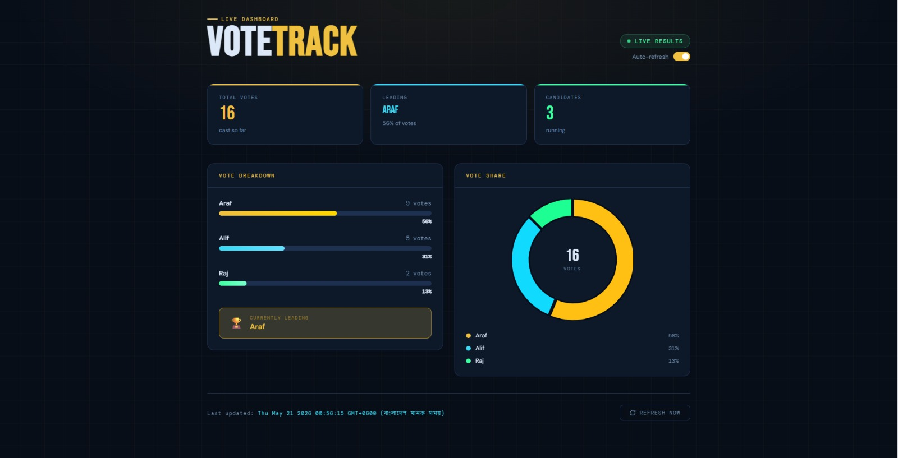
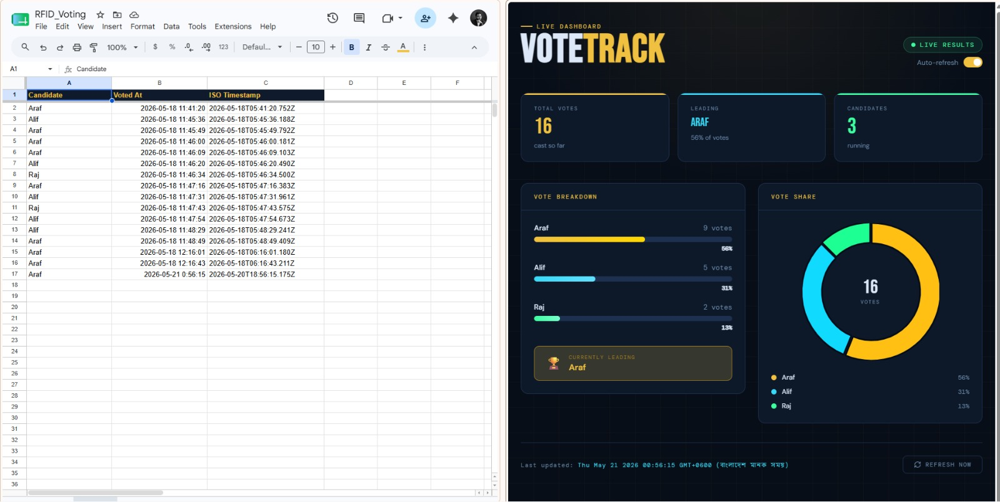
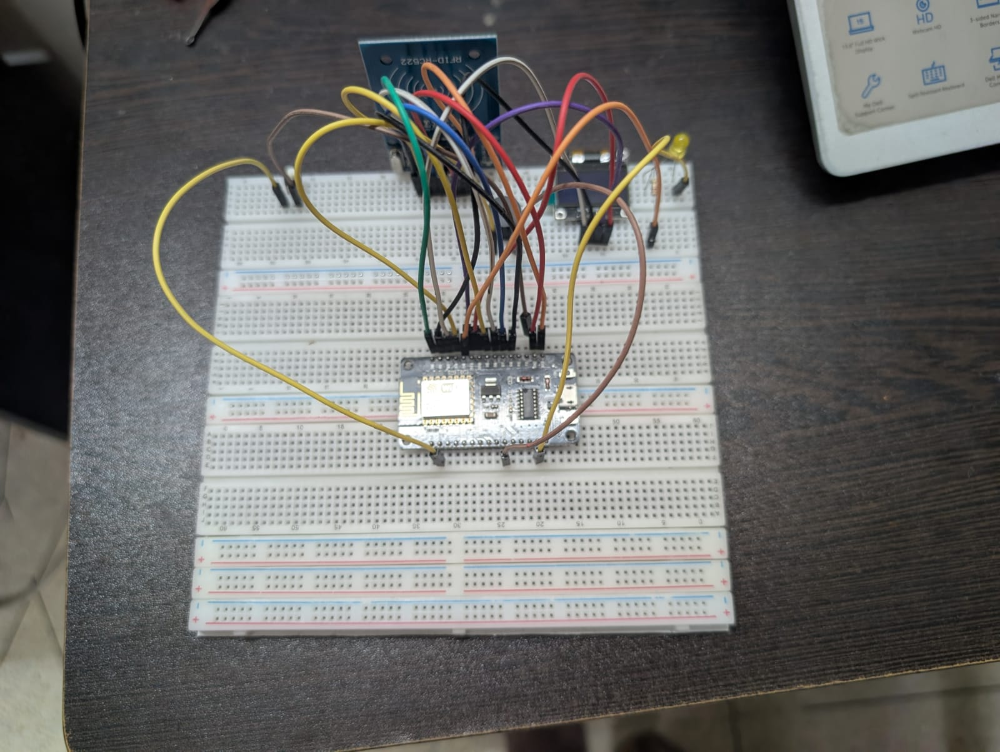

# 📡 RFID-Based Electronic Voting Machine (HCI Project)

A Human-Computer Interaction (HCI) based electronic voting system built using **Arduino Uno**, **RC522 RFID module**, and **SSD1306 OLED display**.

This project demonstrates **usability, feedback design, error prevention, and real-time interaction** using low-cost embedded hardware.

---

## 👨‍🎓 Team Members

- Arafat Hossain (23-50277-1)  
- Rajarshi Mondal (23-50279-1)  
- Al Imran Alif (23-50273-1)  
- Tousif Tarik (23-53577-3)  

🏫 American International University-Bangladesh (AIUB)  
👨‍🏫 Supervisor: Dr. Muhammad Firoz Mridha  

---

## 📌 Project Overview

This system allows users to vote using RFID cards with a simple interactive interface.

### 🔑 Key Features:
- RFID-based voter authentication  
- One-button candidate selection  
- Hold-to-confirm voting system  
- OLED real-time display  
- LED + buzzer feedback  
- Double voting prevention  
- State-machine-based system design  

---

## 🖼️ System Interface

### 🔹 Main Dashboard 

---

### 🔹 Google Sheet Add & Main Screen Dashboard 

---

### 🔹 Hardware Wiring

---

## ⚙️ Hardware Components

- Arduino Uno R3  
- RC522 RFID Module (13.56 MHz)  
- SSD1306 OLED Display (128×64 I2C)  
- Push Button  
- LED Indicator  
- Active Buzzer  
- Breadboard & Jumper Wires  

---

## 🧠 HCI Principles Used

✔ Visibility of system status  
✔ Error prevention (hold-to-confirm)  
✔ User control & freedom (timeout system)  
✔ Recognition over recall  
✔ Minimal cognitive load UI  
✔ Multimodal feedback (OLED + LED + buzzer)  

---

## 🏗️ System Flow
IDLE → RFID SCAN → SELECTION → CONFIRM → RESULT → IDLE

- Non-blocking logic using `millis()`
- Button supports short press & long press actions
- UID-based anti-double voting system

---

## 🚀 How It Works

1. User scans RFID card  
2. System checks voter validity  
3. Candidate selection screen appears  
4. Button cycles through candidates  
5. Hold button to confirm vote  
6. Vote stored and result displayed  
7. System returns to idle state  

---

## 🔐 Security Feature

- Each RFID card has a unique UID  
- Prevents duplicate voting  
- Vote confirmation requires long press  
- System rejects repeated votes instantly  

---

## 📊 Performance

- RFID response time: < 100 ms  
- Button response: ~1 ms  
- Voting time: ~5–8 seconds  
- Real-time OLED updates  

---

## 🧰 Libraries Used

- MFRC522 RFID Library  
- Adafruit SSD1306 Library  
- Adafruit GFX Library  
- SPI & Wire (Arduino Core)

---

## 📁 Project Structure
RFID-Voting-Machine/
│
├── main.ino
├── README.md
├── image/
│ ├── WhatsApp Image 2026-05-21 at 4.49.31 AM.jpeg
│ ├── WhatsApp Image 2026-05-21 at 4.49.32 AM.jpeg
│ ├── WhatsApp Image 2026-05-21 at 5.14.20 AM.jpeg

---

## 💡 Future Improvements

- EEPROM-based vote storage  
- Cloud dashboard (Google Sheets / ESP8266)  
- Admin authentication panel  
- Encrypted RFID system  
- Mobile app integration  

---

## 📚 References

- Nielsen, J. (1994) – Usability Heuristics  
- Norman, D. A. – *The Design of Everyday Things*  
- Arduino Documentation: https://www.arduino.cc/reference/en/  
- MFRC522 Library: https://github.com/miguelbalboa/rfid  
- Adafruit SSD1306: https://github.com/adafruit/Adafruit_SSD1306  

---

## 🙏 Acknowledgement

We sincerely thank **Dr. Muhammad Firoz Mridha** for guidance and support.  
Special thanks to **AIUB** and the open-source Arduino community.

---

## ⚠️ Disclaimer

This project is developed for **educational purposes only** and is not intended for real-world election systems.

---

## ⭐ If you like this project

Give this repository a ⭐ on GitHub!
